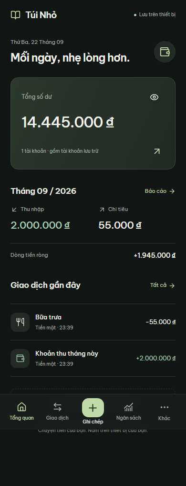
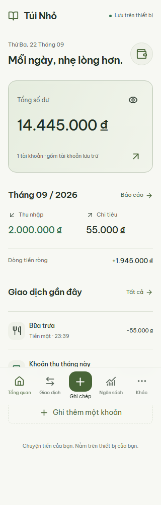
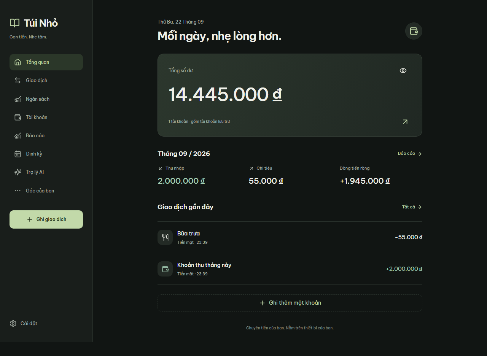

# Kiểm tra bàn giao — 22/09/2026

Đã kiểm tra trên Windows, Node 24, Chromium của Playwright.

| Kiểm tra | Kết quả |
| --- | --- |
| Cài npm + lockfile | Thành công |
| TypeScript strict / production build | Qua |
| ESLint | Qua |
| Unit / repository / migration / API contract | 20 bài qua |
| Browser E2E | 4 bài qua |
| Thu / chi / chuyển / sửa / xóa + undo | Qua, số dư đối chiếu chính xác |
| Ngân sách / xác nhận định kỳ không trùng | Qua |
| JSON export + replacement restore | Qua |
| PWA reload và tạo giao dịch khi offline | Qua |
| AI tạo bản nháp, sửa rồi xác nhận | Qua với API mock |
| Consent / CORS / access code / rate limit / schema | Qua kiểm thử proxy |
| Responsive 320 / 390 / 412 / 768 / 1280 | Không tràn ngang |
| Dark / light, sheet 320px, bỏ thay đổi + Back | Qua |
| Capacitor Android sync | Qua |
| Manifest + frontend secret/direct Gemini scan | Qua |
| Three / React Three / GSAP / Matter | Không có trong dependency tree |
| npm audit | 0 vulnerabilities tại thời điểm kiểm tra |
| Node production health / SPA fallback / manifest | HTTP 200, no-cache shell, CSP hoạt động |

Chưa xác minh: Gemini thật (chưa có server key); build APK, bàn phím/native share trên Android thật (chưa có JDK/SDK); Docker image và deploy Dokploy thật (không có Docker runtime/domain VPS trong phiên này). Các bước cấu hình có trong README và DOKPLOY.md. Không coi mock AI là kiểm thử live API.

Hiệu năng: route Reports/AI tải riêng, JS chính khoảng 53 KB gzip (vendor React/Dexie/Zod tách riêng); shell offline gồm font và route khoảng 758 KiB. Danh sách giới hạn 60 hàng DOM/trang. Không animation chạy liên tục. Chưa đo Lighthouse hay thời gian khởi động trên thiết bị Android tầm trung.

Ảnh giao diện dùng dữ liệu kiểm thử, không phải dữ liệu thật:

